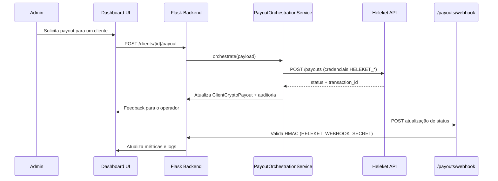

# Integração de Pagamentos Heleket

Esta pasta contém a documentação completa da integração com o gateway de pagamentos Heleket para payouts em criptomoedas.

## 📚 Documentação Disponível

### [HELEKET_DATA_MAPPING.md](./HELEKET_DATA_MAPPING.md)
Inventário de dados e mapeamento de campos entre o sistema atual e a API Heleket:
- Campos disponíveis em `clients` e `plans`
- Estruturas propostas: `client_wallet_profile` e `client_crypto_payouts`
- Gatilhos de negócio (manual, agendado, bônus)
- Lacunas identificadas e próximos passos

### [HELEKET_CLIENT.md](./HELEKET_CLIENT.md)
Documentação técnica do cliente da API Heleket:
- Guia de instalação e configuração
- Exemplos de uso (criar payout, consultar status, cancelar)
- Gestão de idempotência
- Tratamento de erros e retry
- Integração com modelo ClientCryptoPayout
- Boas práticas e referência de API

## 🚀 Quick Start

### 1. Configurar Credenciais

Adicione ao seu `.env` ou `.env.local`:

```bash
HELEKET_PROJECT_URL=https://api.heleket.com
HELEKET_MERCHANT_ID=your-merchant-id
HELEKET_API_KEY=your-api-key
HELEKET_WEBHOOK_SECRET=shared-secret-for-hmac
```

> ✅ **Checklist de ambiente**
>
> | Variável | Finalidade |
> | --- | --- |
> | `HELEKET_PROJECT_URL` | Endpoint base da API Heleket |
> | `HELEKET_MERCHANT_ID` | Identificador fornecido pela Heleket |
> | `HELEKET_API_KEY` | Chave de acesso à API |
> | `HELEKET_WEBHOOK_SECRET` | Segredo para validar `X-Heleket-Signature` no webhook |

### 2. Exemplo de Uso

```python
from app.services.heleket_client import HeleketClient
from app.models.client_crypto_payout import ClientCryptoPayout

# Criar registro de payout
idempotency_key = HeleketClient.generate_idempotency_key(
    client_id="client-123",
    asset="USDT"
)

success, payout_id, error = ClientCryptoPayout.create(
    client_id=client_id,
    asset="USDT",
    network="TRON",
    amount=100.50,
    wallet_address="TRX1234567890",
    idempotency_key=idempotency_key,
    origin=ClientCryptoPayout.ORIGIN_MANUAL
)

# Enviar para Heleket
if success:
    heleket = HeleketClient()
    api_success, response, api_error = heleket.create_payout(
        wallet_address="TRX1234567890",
        asset="USDT",
        network="TRON",
        amount=100.50,
        idempotency_key=idempotency_key
    )
    
    if api_success:
        # Atualizar status
        ClientCryptoPayout.update_status(
            payout_id=payout_id,
            status=ClientCryptoPayout.STATUS_BROADCAST,
            heleket_transaction_id=response["transaction_id"]
        )
```

## 📊 Status da Integração

### ✅ Sprint 1: Fundação (Concluída)
- [x] Mapeamento de dados e gatilhos de negócio
- [x] Configuração segura de credenciais
- [x] Cliente da API Heleket
- [x] Modelo de persistência `client_crypto_payouts`

### ✅ Sprint 2: Orquestração (Concluída)
- [x] Serviço `PayoutOrchestrationService` integrando formulário admin + API Heleket
- [x] Workflow administrativo (`clients/manage.html`) com CTA de payout
- [x] Webhook `/payouts/webhook` com validação `HELEKET_WEBHOOK_SECRET`

### 🔄 Sprint 3: Monitoramento (Em andamento)
- [x] Reconciliação automática (`PayoutReconciliationService` + comando CLI `flask reconcile-payouts`)
- [x] Analytics e KPIs expostos nos dashboards administrativos
- [ ] Testes end-to-end e QA exploratório

> **Próximos passos**: expandir cenários de testes integrados (simulação end-to-end com dados reais) e instrumentar alertas de falha em canais internos.

## 🔄 Fluxo ponta a ponta (Dashboard ⇄ Heleket)



## 🧱 Arquitetura & Schemas

- **Pydantic + Forms**: Os formulários administrativos reutilizam `FormModel`/`UpdateFormModel` (`app/schemas/forms.py`) para validar entradas, gerar payloads e mascarar campos sensíveis. Schemas específicos de payout vivem em `app/schemas/client.py` e `app/schemas/domain.py`, seguindo o padrão modular estabelecido na refatoração CRUD.
- **Persistência**: `ClientCryptoPayout` centraliza regras, índices (`heleket_transaction_id`) e auditoria. Utilize os métodos da model para atualizar status e payloads.
- **Serviços**: `PayoutOrchestrationService` e `PayoutReconciliationService` encapsulam chamadas Heleket, mantendo idempotência e logging consistente via `audit_helper`.
- **Dashboards**: Métricas expostas na UI consomem as agregações do modelo (`ClientCryptoPayout.get_statistics`) e geram `payout_insights` para os templates.
- **Extensibilidade**: Novos fluxos (ex.: bônus por campanha) devem criar seus próprios schemas/formulários, reutilizando o mesmo pipeline de orquestração.

## 🌐 Endpoints & Rotinas

- `POST /clients/<client_id>/payout`: dispara orquestração manual (administrativo)
- `POST /payouts/reconcile`: reconciliação manual via painel admin
- `POST /payouts/webhook`: recebe callbacks Heleket (assinado com `HELEKET_WEBHOOK_SECRET`)
- `flask reconcile-payouts`: comando CLI para agendar reconciliação automática
- Dashboards consomem `GET /dashboard/api/admin-stats` e `GET /dashboard/api/admin-clicks` para alimentar KPIs de payout

## 🔐 Segurança

- **Credenciais**: Sempre use variáveis de ambiente, nunca hardcode
- **Produção**: Armazene credenciais no AWS Secrets Manager
- **Idempotência**: Use chaves determinísticas para evitar duplicatas
- **Auditoria**: Todos os payouts são registrados com logs completos

## 🧪 Testes

Execute os testes unitários:

```bash
# Testes do cliente Heleket
pytest tests/unit/test_heleket_client.py -v

# Testes do modelo de payout
pytest tests/unit/test_client_crypto_payout.py -v

# Todos os testes
pytest tests/unit/ -v
```

**Cobertura atual**: 34 casos de teste
- 16 testes para HeleketClient
- 18 testes para ClientCryptoPayout

## 📞 Suporte

Para dúvidas sobre a integração:
1. Consulte a documentação técnica em `HELEKET_CLIENT.md`
2. Revise o mapeamento de dados em `HELEKET_DATA_MAPPING.md`
3. Verifique os testes unitários para exemplos práticos
4. Entre em contato com a equipe de Backend

## 🔗 Links Úteis

- [Documentação da API Heleket](https://docs.heleket.com) _(link de referência)_
- [TODO.md - Sprint 1](../TODO.md#sprint-1-fundação-da-integração-heleket--setup-inicial)
- [CHANGELOG.md](../CHANGELOG.md)
- [AWS Deployment Guide](./AWS_DEPLOYMENT.md)
